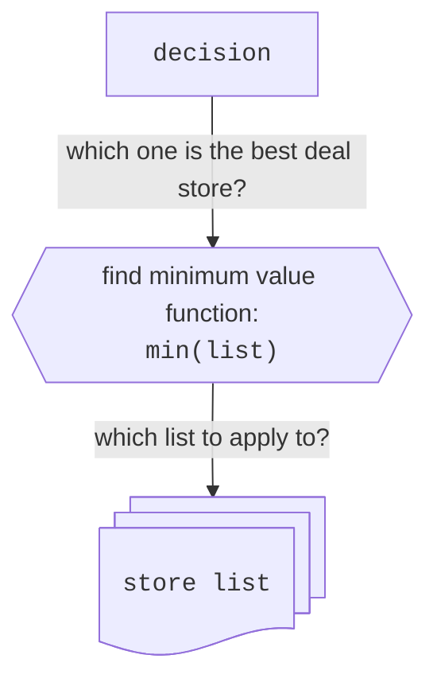
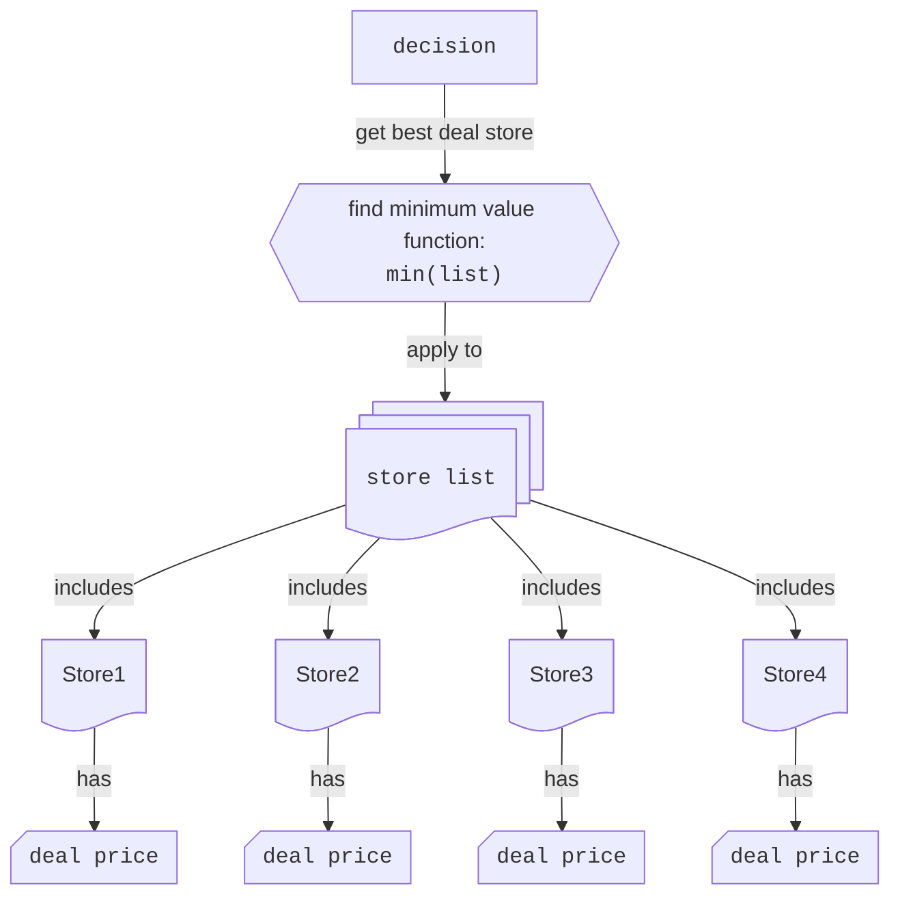
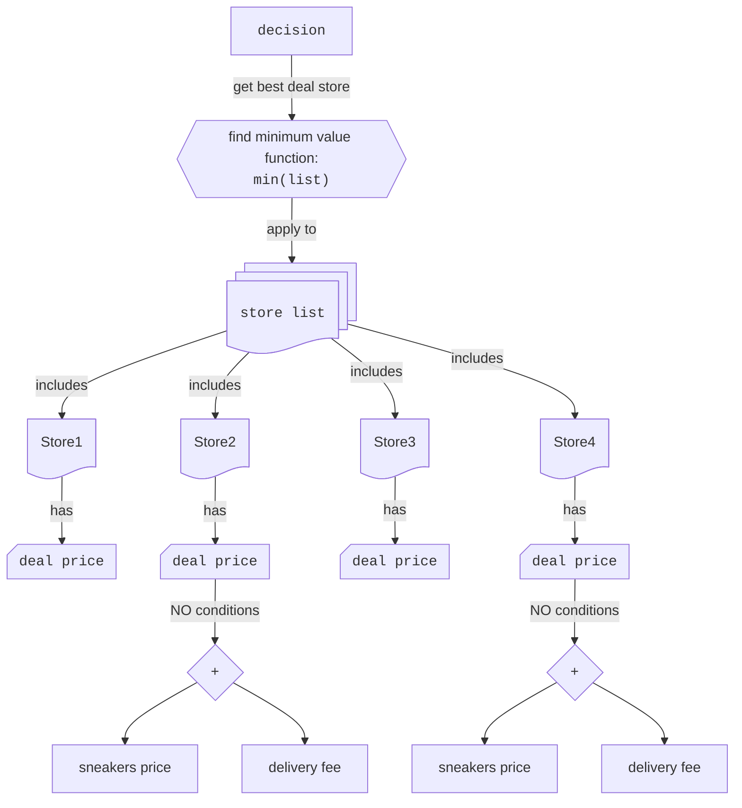
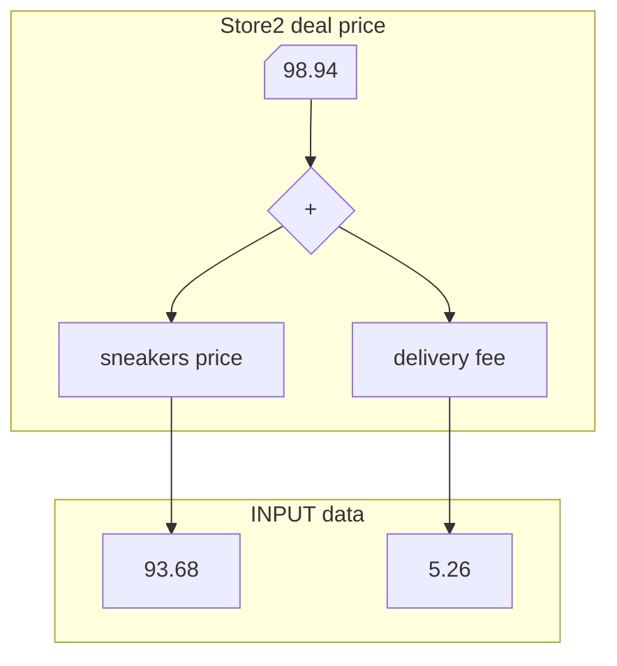
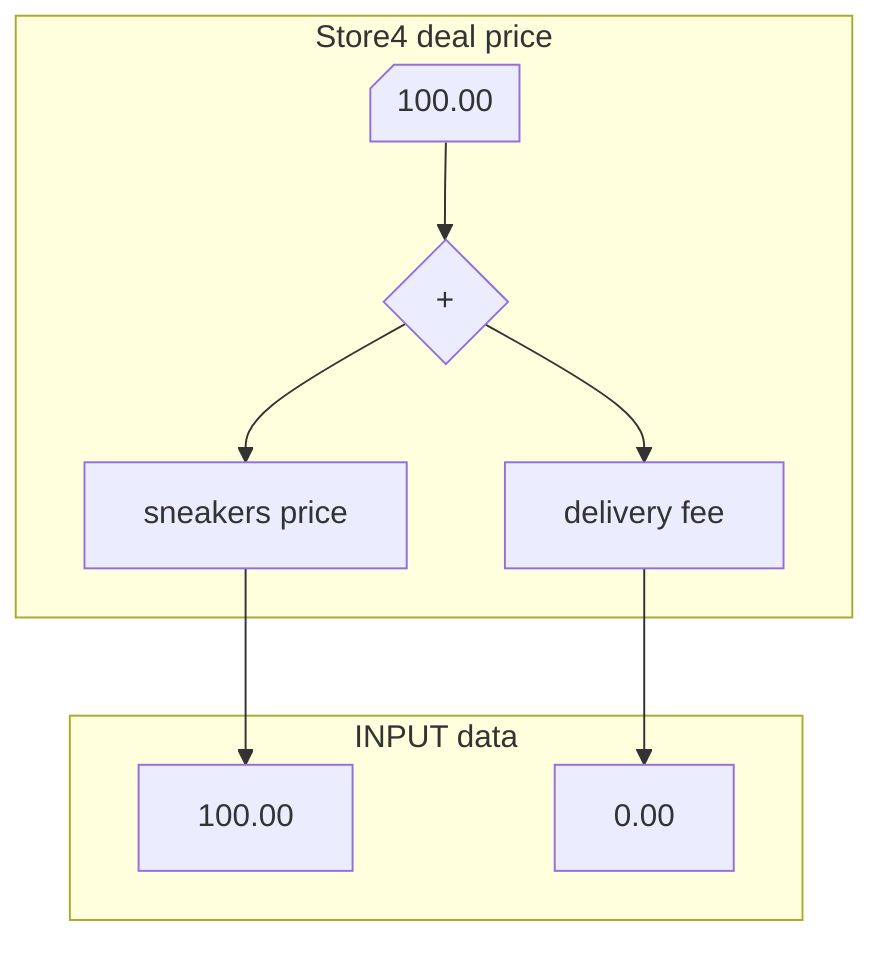
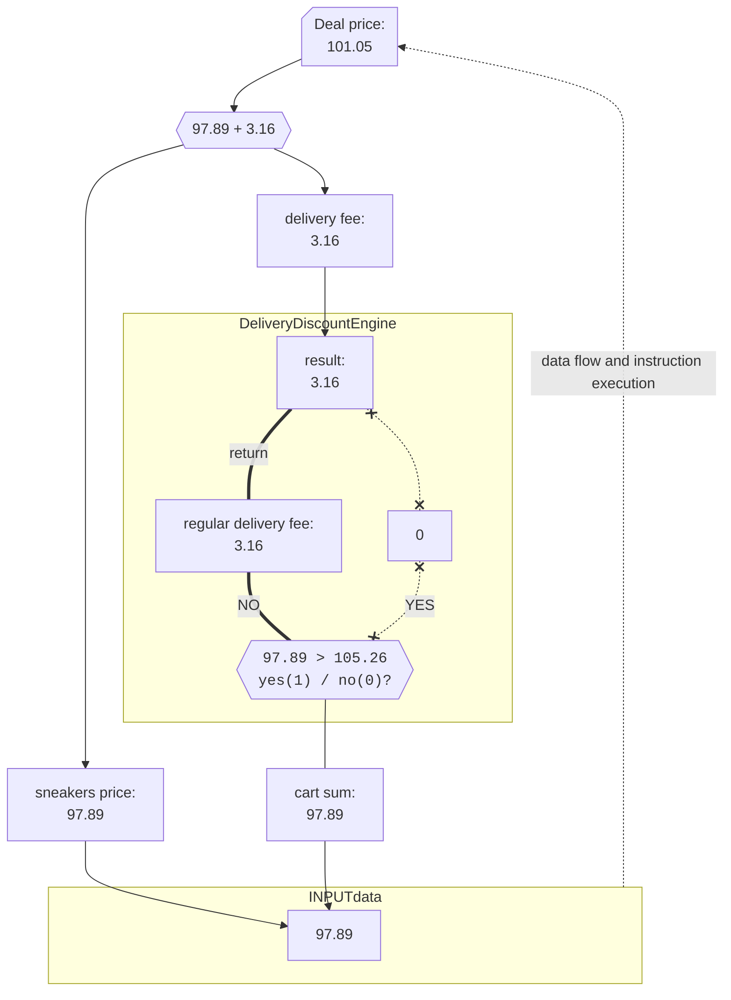
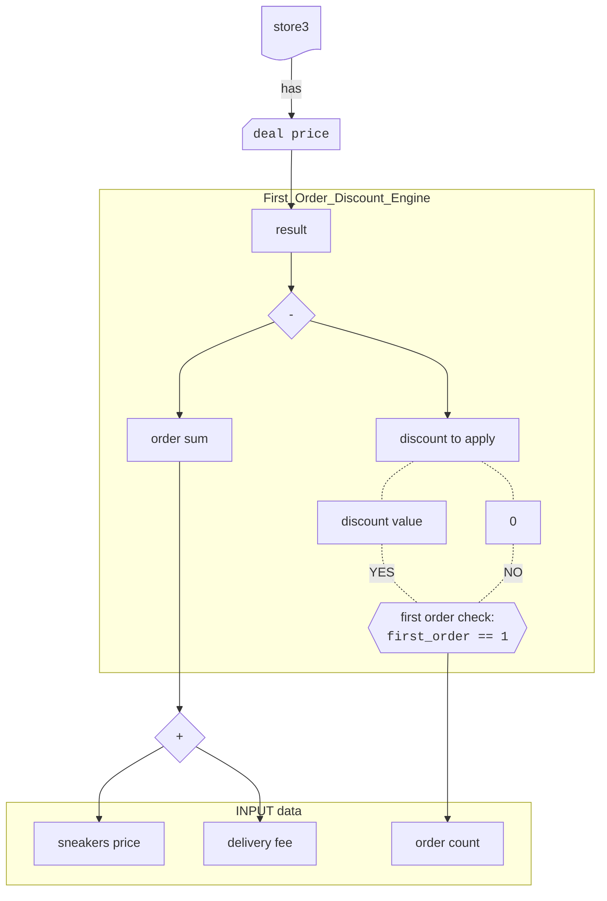
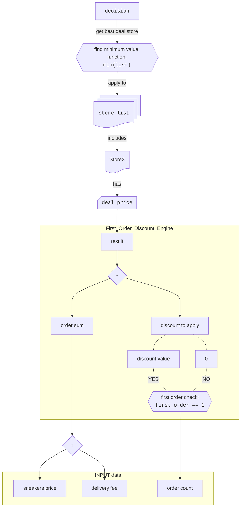
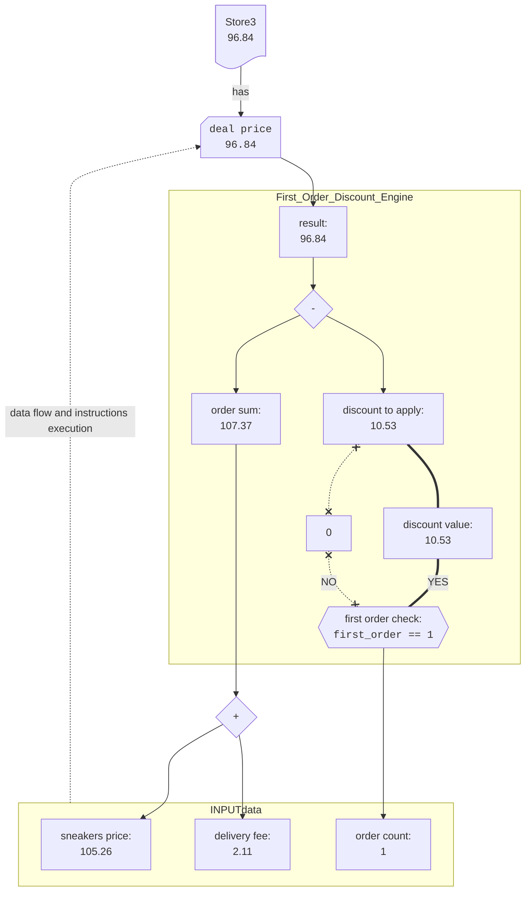
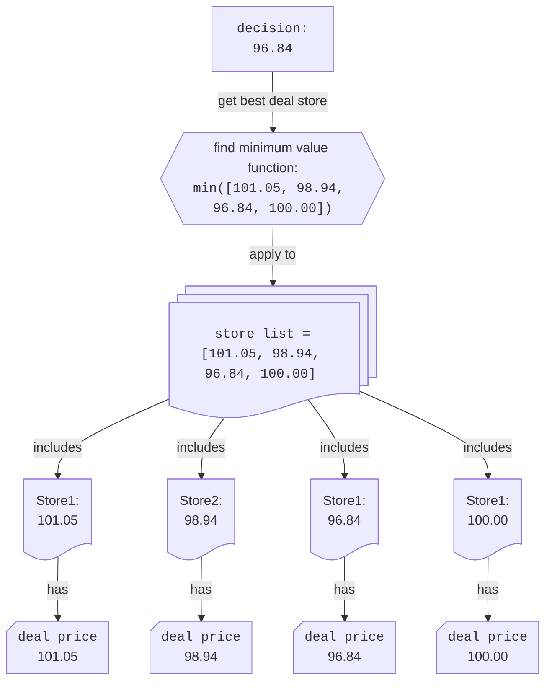

# Table of Contents
<a name="toc"></a>

- [Table of Contents](#table-of-contents)
- [1. Sneakers](#1-sneakers)
- [2. Problem](#2-problem)
- [3. Categorise the problem](#3-categorise-the-problem)
- [4. Elements: extract](#4-elements-extract)
  - [4.1. `decision`](#41-decision)
  - [4.2. `store list`](#42-store-list)
  - [4.3. `store`](#43-store)
  - [4.4. `deal price`](#44-deal-price)
- [5. Elements: relations](#5-elements-relations)
  - [5.1. `decision` \<-\> `store list`](#51-decision---store-list)
  - [5.2 `store list` \<-\> `store`](#52-store-list---store)
  - [5.3 `store` \<-\> `deal price`](#53-store---deal-price)
- [6. Elements: diagram](#6-elements-diagram)
- [7. `deal price`](#7-deal-price)
  - [7.1 `deal price` no additional conditions](#71-deal-price-no-additional-conditions)
    - [7.1.1. `deal price` no additional conditions algorithm](#711-deal-price-no-additional-conditions-algorithm)
    - [7.1.2. Store2 \& Store4 problem diagrams](#712-store2--store4-problem-diagrams)
    - [7.1.3. Store2 apply algorithm](#713-store2-apply-algorithm)
    - [7.1.4. Store4 apply algorithm](#714-store4-apply-algorithm)
  - [7.2. `deal price` with additional conditions](#72-deal-price-with-additional-conditions)
    - [7.2.1 Store 1 delivery discount](#721-store-1-delivery-discount)
    - [7.2.2. Store1 problem diagrams](#722-store1-problem-diagrams)
    - [7.2.3. Store1 apply algorithm](#723-store1-apply-algorithm)
    - [7.2.4 Store3 first order discount](#724-store3-first-order-discount)
    - [7.2.5. Store3 problem diagrams](#725-store3-problem-diagrams)
    - [7.2.6 Store3 apply algorithm](#726-store3-apply-algorithm)
- [8. Working out the solution](#8-working-out-the-solution)
- [9. `deal price` algorithmic patterns](#9-deal-price-algorithmic-patterns)


# 1. Sneakers
[Back to the table of contents](#toc)
This is a  README for the mock project "Sneakers".
I am still learning and focus on develop the following skills:
- problem solving
- logical reasoning
- algorithmic thinking
- mathematical thinking
- computer science and software engineering

If you are interested please join my reasoning logic and feel free to criticize it.


# 2. Problem
[Back to the table of contents](#toc)

Tom wants to buy a pair of new sneakers. He went to a nearby store and tried a few pairs of different brands. He picked a specific pair of sneakers that he liked. Considering the offline store price Tom decided to check if he could save some money by ordering them online.

Tom found a few websites that sell the sneakers he picked. To decide which store to buy from he made the following table:
<a name="initial-table"></a>
| Store   | Sneakers price, USD | Delivery fee, USD | Additional Conditions                         |
| ------- | ------------------- | ----------------- | --------------------------------------------- |
| Store 1 | $97.89$             | $3.16$            | Free delivery for cart sums over $105.26$ USD |
| Store 2 | $93.68$             | $5.26$            | None                                          |
| Store 3 | $105.26$            | $2.11$            | Discount of $10.53$ USD on the first order    |
| Store 4 | $100.00$            | Free              | None                                          |


# 3. Categorise the problem
[Back to the table of contents](#toc)

Tom needs to decide which store to buy from. Assuming that the quality of the sneakers is the same, the `decision` problem is to choose the store with the lowest expenses (best `deal price`).

Lets take a brief look at the table.

---

# 4. Elements: extract
[Back to the table of contents](#toc)

`decision`, `store list`, `store`, `deal price`


Tom's table represents a `store list` helping to make a `decision` to pick a `store` based on the best `deal price`.

---

## 4.1. `decision`
[Back to the table of contents](#toc)

The most important element of the problem is the answer itself: a specific store, `decision` to be made.

---

## 4.2. `store list`
[Back to the table of contents](#toc)

Second element is the store list to pick a store from.

>[!tip]
`python list` small bite (skippable section).
We can store lists inside computer memory using `python` programming language.
Put comma "`,`" separated items in square "`[ ]`" brackets to create a list: `[item1, item2, item3 ]`.  Use equals `=` to assign a name to a list.
Use `print( )` to display a list. `#` comment a line (execution ignore).

```python
# create sneakers price list and assign it to a variable `sneakers_price_list`
sneakers_price_list = [97.89, 93.68, 105.26, 100.00]
# print on display sneakers_price_list
print(sneakers_price_list)
```
result:
```
[97.89, 93.68, 105.26, 100.00]
```

>[!tip]
>TRY and PLAY online [Click the red RUN button (top right) and feel free to change the code and play around](https://onecompiler.com/python/43gze9xnr)

---

## 4.3. `store`
[Back to the table of contents](#toc)

Store list consists of individual stores. It is the first Tom's table column.

---

## 4.4. `deal price`
[Back to the table of contents](#toc)

The `decision` is based on the information about the `store` `deal price`. There is no such information as `deal price` in the Tom's table but we understand that the other 3 columns provide us with essential information related to the `deal price`:
- sneakers price
- delivery fee
- additional conditions

We can make `deal price` element more detailed by adding sub-elements to it but the main point here that no relevant information is lost. To keep it simple we avoid adding more known sub elements at this stage. Moreover the system  can increase in complexity. That means that Tom later can find some other factors impacting the deal price: (transaction fees, delivery insurance etc.). Having such abstraction as `deal price` can help us to handle this new information.

To sum up, we can say that we united 3 columns into one abstraction: **`deal price`**.
The Tom's table could look something like this:

<a name="deal-price-abstraction-table"></a>
<table>
  <thead>
    <tr>
      <th rowspan="2">Store</th>
      <th colspan="3">Deal price, USD</th>
    </tr>
    <tr>
      <th>Sneakers price, USD</th>
      <th>Delivery fee, USD</th>
      <th>Additional Conditions</th>
    </tr>
  </thead>
  <tbody>
    <tr>
      <td>Store 1</td>
      <td>$97.89</td>
      <td>$3.16</td>
      <td>Free delivery for cart sums over $105.26 USD</td>
    </tr>
    <tr>
      <td>Store 2</td>
      <td>$93.68</td>
      <td>$5.26</td>
      <td>None</td>
    </tr>
    <tr>
      <td>Store 3</td>
      <td>$105.26</td>
      <td>$2.11</td>
      <td>Discount of $10.53 USD on the first order</td>
    </tr>
    <tr>
      <td>Store 4</td>
      <td>$100.00</td>
      <td>Free</td>
      <td>None</td>
    </tr>
  </tbody>
</table>

> [!important]
> The `deal price` abstraction simplifies problem solving and can potentially make the algorithm more flexible. Later we can add other `deal price` sub-elements if needed (like transaction fees, delivery insurance etc.).

---

# 5. Elements: relations
[Back to the table of contents](#toc)

For now we got 4 elements:
 - `decision`
 - `store list`
 - `store`
 - `deal price`

Now lets take a closer look at elements combinatorics based on the common sense.

---

## 5.1. `decision` <-> `store list`
[Back to the table of contents](#toc)

`decision` is a result of searching the lowest `deal price`  in the `store list`.
Hence "searching the lowest `deal price`  in the `store list`" is the relationship type between these 2 elements. We recognise a specific algorithm for this relation type: searching minimum value in a list.

Input (algorithms gets a data to work on): `store list`
Algorithm (apply to input): find minimum
Output (algorithm returns a value): `decision`

>[!note]
>Finding list minimum data flow diagram:
>```mermaid
>%%{ init : { "themeVariables": { "htmlLabels": true }}}%%
>graph LR
>	in@{label: "INPUT: \n <code>list=[item1, item2, item3]</code>"}
>	fn@{shape: hex, label: "ALGO\n Find minimum value\n algorithm:\n <code>min(list)</code>"}
>	out@{label: "OUTPUT: \n <code>item</code> "}
>	in --> fn --> out
>```

We can reverse the data flow (output -> input) by starting with asking questions.
- `decision` is asking: Which is the best deal store? Problem text does not contain such information. We decided to applying the `min( )` algorithm to find it out.
- `min( )`  algorithm: Where is my input? Which data should I work on?
- `store list` here is the input data.

This is recursive style of thinking.


---

This diagrams depict that the questions and the data flows are moving into opposite directions. The question approach can help to chunk the problem from bigger to smaller parts instead of applying combinatorics to known data.

>[!tip]
`python list` small bite (skippable section)
Fortunately `python` has a built-in function `min()`. It can take a list of numbers and return a minimal  value. Put a list name inside round "`( )`" brackets of `min()`: `min(list_name)`.

Lits change our [small python program](#42-store-list)


```python
# 1. INPUT data
# create sneakers price list and assign it to a variable `sneakers_price_list`
sneakers_price_list = [97.89, 93.68, 105.26, 100.00]
# print on display sneakers_price_list
print(f"The sneakers price list: {sneakers_price_list}")

# 2. ALGORITHM application
# apply min() to `sneakers_price_list` and assign the result to a variable `minimal_sneakers_price`
minimal_sneakers_price = min(sneakers_price_list)

# 3. OUTPUT data (applied algorithm result)
# print  minimal_sneakers_price
print(f"Minimal price is: {minimal_sneakers_price}")
```
result:
```
The sneakers price list: [97.89, 93.68, 105.26, 100.0]
Minimal price is: 93.68
```

>[!tip]
>TRY and PLAY online
[Click the red RUN button (top right) and feel free to change the code and play around](https://onecompiler.com/python/43gzn7zvr)


>[!CAUTION]
> `min(sneakers_price_list)` is NOT a minimal `store` `deal price`! We excluded other important pricing factors such as delivery fee and store-specific conditions. See the difference in the  [table above](#deal-price-abstraction-table).

---

## 5.2 `store list` <-> `store`
[Back to the table of contents](#toc)

`store list` includes one or more stores. `store` is an element of the `store list`.


---
## 5.3 `store` <-> `deal price`
[Back to the table of contents](#toc)

`deal price` is a property of the `store`


# 6. Elements: diagram
[Back to the table of contents](#toc)

Considering the problem elements and their relationships we can draw the following diagram:




We follow top to bottom approach, question driven approach to avoid getting lost into pricing details and other distractions.

# 7. `deal price`
[Back to the table of contents](#toc)

Now we can discuss the `deal price` in detail. As we mentioned before `deal price` is a property of the `store`. The `deal price` data is in 3 columns of the table: Sneakers price, Delivery fee and Additional Conditions.
We can notice that additional conditions are not applied to each store. That means that `deal price` calculation algorithm can be different for each store.

## 7.1 `deal price` no additional conditions
[Back to the table of contents](#toc)

### 7.1.1. `deal price` no additional conditions algorithm
[Back to the table of contents](#toc)

Too keep it simple we start with the stores that have no additional conditions.

> [!note]
> $deal\ price = sneakers\ price + delivery\ fee$

### 7.1.2. Store2 & Store4 problem diagrams
[Back to the table of contents](#toc)

<a name="non-conditional-deal-price"></a>
```mermaid
%%{ init : { "themeVariables": { "htmlLabels": true }}}%%
graph TB
  Sum@{shape: diamond, label: "&plus;"}
  Sum --> sneakers_price@{shape: rect, label: "sneakers price"} & delivery_fee@{shape: rect, label: "delivery fee"}
  Deal_price@{shape: card, label: "Deal price"}
  Deal_price -->Sum
  ```

>[!note]
> The whole path looks like this:
  ```mermaid
%%{ init : { "themeVariables": { "htmlLabels": true }}}%%
graph TB
  decision@{shape: rect, label: "<code>decision</code>"}
  decision -->|get best deal store| minf
  minf@{shape: hex, label: "find minimum value function:\n <code>min(list)</code>"}
  minf -->|apply to| StoreList@{shape: docs, label: "<code>store list</code>"}
  StoreList --> |includes|Store@{shape: doc}

  Store@{shape: doc} --> |has|deal_price2@{shape: card, label: "<code>deal price</code>"}
subgraph "<code></code>"
  direction TB
  Sum2@{shape: diamond, label: " + "}
  Sum2 --> sneakers_price1@{shape: rect, label: "sneakers price"} & delivery_fee1@{shape: rect, label: "delivery fee"}
  deal_price2-->|NO conditions|Sum2
  end
```
---


Stores 2 and 4 has no extra no conditions.
The model is applicable to both stores.
>[!note]
> General model looks like this:



> [!tip]
> We can see the Store 2 and Store 4 apply the same algorithm to calculate the `deal price`. The only difference is the input data.

### 7.1.3. Store2 apply algorithm
[Back to the table of contents](#toc)

- sneakers price: $93.68$ USD
-  delivery fee: $5.26$ USD
- Additional Conditions: None

<a name="non-conditional-deal-price-store2"></a>


### 7.1.4. Store4 apply algorithm
[Back to the table of contents](#toc)

- sneakers price: $100.00$ USD
-  delivery fee: $0.00$ USD
- Additional Conditions: None

<a name="non-conditional-deal-price-store4"></a>


## 7.2. `deal price` with additional conditions
[Back to the table of contents](#toc)

Now things are getting more complicated. We need to consider the additional conditions.
Lets take a closer look at wordings in Additional Conditions column of the [table](#initial-table).
Lets repeat out approach and extract elements.

### 7.2.1 Store 1 delivery discount
[Back to the table of contents](#toc)

> Store 1:
> Free delivery for cart sums over $105.26$ USD.

In Store1 case the `delivery fee` is conditional and depends on the `cart sum`.
Elements are: `cart sum`, `threshold`, `regular delivery fee`

`cart sum` is a variable which depends on products in the cart, their price and quantity. In this case the cart sum is equal to the `sneakers price`.
The `threshold` is a constant value: $105.26$. `regular delivery fee` is a constant value: $3.16$.


> $delivery\ fee = 0$ if $cart\ sum > threshold$ else $delivery\ fee$

The main formula atays the same:

> $deal\ price = sneakers\ price + delivery\ fee$

Lets replace $"delivery\ fee"$ with fromulated special conditions

> $deal\ price = sneakers\ price + ($ `0`$\ if\ cart\ sum > threshold,\ else$ `regular delivery fee`)

To get the `deal price` we need to evaluate the expression in the brackets. Lets call it Delivery Discount Engine`.

### 7.2.2. Store1 problem diagrams
[Back to the table of contents](#toc)

<a name="delivery-discount-deal-price"></a>
```mermaid
%%{ init : { "themeVariables": { "htmlLabels": true }}}%%
graph TB
  Deal_price@{shape: card, label: "Deal price"}
  Sum@{shape: diamond, label: " + "}
  Deal_price -->Sum
  Sum --> sneakers_price@{shape: rect, label: "sneakers price"}
  Sum --> delivery_fee@{shape: rect, label: "delivery fee"}

  delivery_fee --> Result
    GT@{shape: hex, label: "<code>cart sum > threshold \n yes(1) / no(0)?</code>"}

    DeliveryFee@{shape: rect, label: "<code>regular delivery fee</code>"} -.-|NO| GT
    DeliveryNull@{shape: rect, label: "0"} -.- |YES|GT

    Result
    Result -.- DeliveryFee
    Result -.- DeliveryNull

  subgraph DeliveryDiscountEngine
    direction TB
    Result
    DeliveryFee
    DeliveryNull
    GT
  end

  GT --- cart_sum@{shape: rect, label: "cart sum"}

  ```

 > [!note]
 > The whole path looks like this:

```mermaid
%%{ init : { "themeVariables": { "htmlLabels": true }}}%%
graph TB
  decision@{shape: rect, label: "<code>decision</code>"}
  decision -->|get best deal store| minf
  minf@{shape: hex, label: "find minimum value function:\n <code>min(list)</code>"}
  minf -->|apply to| StoreList@{shape: docs, label: "<code>store list</code>"}
  StoreList --> |includes|Store@{shape: doc}

  Store@{shape: doc} --> |has|store1.deal_price@{shape: card, label: "<code>deal price</code>"}

  store1.deal_price@{shape: card, label: "Deal price"}
  store1.sum@{shape: diamond, label: " + "}
  store1.deal_price --> store1.sum
  store1.sum --> store1.sneakers_price@{shape: rect, label: "sneakers price"}
  store1.sum --> store1.delivery_fee@{shape: rect, label: "delivery fee"}

  store1.delivery_fee --> Result
    GT@{shape: hex, label: "<code>cart sum > threshold\n yes(1) / no(0)?</code>"}

    DeliveryFee@{shape: rect, label: "<code>regular delivery fee</code>"} -.-|NO| GT
    DeliveryNull@{shape: rect, label: "0"} -.- |YES|GT
    Result
    Result -.- DeliveryFee
    Result -.- DeliveryNull
  subgraph DeliveryDiscountEngine
    direction TB
    Result
    DeliveryFee
    DeliveryNull
    GT
  end
GT-->cart_sum@{shape: rect, label: "cart sum"}

```


 > [!note]
 > General diagram

  ```mermaid
%%{ init : { "themeVariables": { "htmlLabels": true }}}%%
graph TB
  decision@{shape: rect, label: "<code>decision</code>"}
  decision -->|get best deal store| minf
  minf@{shape: hex, label: "find minimum value function:\n <code>min(list)</code>"}
  minf -->|apply to| StoreList@{shape: docs, label: "<code>store list</code>"}
  StoreList --> |includes|Store1@{shape: doc}
  StoreList --> |includes|Store2@{shape: doc}
  StoreList --> |includes|Store3@{shape: doc}
  StoreList --> |includes|Store4@{shape: doc}

  Store1@{shape: doc} --> |has|store1.deal_price@{shape: card, label: "<code> deal price </code>"}
  Store2@{shape: doc} --> |has|Store2.deal_price@{shape: card, label: "<code> deal price </code>"}
  Store3@{shape: doc} --> |has|Store3.deal_price@{shape: card, label: "<code>deal price</code>"}
  Store4@{shape: doc} --> |has|Store4.deal_price@{shape: card, label: "<code>deal price</code>"}

%% STORE1
  store1.sum@{shape: diamond, label: " + "}
  store1.deal_price --> store1.sum
  store1.sum --> store1.sneakers_price@{shape: rect, label: "sneakers price"}
  store1.sum --> store1.delivery_fee@{shape: rect, label: "delivery fee"}
  store1.delivery_fee --> Result
    GT@{shape: hex, label: "<code>cart sum > threshold \n yes(1) / no(0)?</code>"}
    DeliveryFee@{shape: rect, label: "<code> regular delivery fee</code>"} -.-|NO| GT
    DeliveryNull@{shape: rect, label: "0"} -.- |YES|GT
    Result
    Result -.- DeliveryFee
    Result -.- DeliveryNull
  subgraph DeliveryDiscountEngine
    direction TB
    Result
    DeliveryFee
    DeliveryNull
    GT
  end
GT-->cart_sum@{shape: rect, label: "cart sum"}

%% STORE2
	Store2.deal_price.sum@{shape: diamond, label: " + "}
	Store2.deal_price.sum --> Store2.sneakers_price@{shape: rect, label: "sneakers price"}
	Store2.deal_price.sum --> Store2.deal_price.delivery_fee@{shape: rect, label: "delivery fee"}
	Store2.deal_price -->|NO conditions|Store2.deal_price.sum
%% STORE4
	Store4.deal_price.sum@{shape: diamond, label: " + "}
	Store4.deal_price.sum --> Store4.sneakers_price@{shape: rect, label: "sneakers price"}
	Store4.deal_price.sum --> Store4.deal_price.delivery_fee@{shape: rect, label: "delivery fee"}
	Store4.deal_price -->|NO conditions|Store4.deal_price.sum
```

### 7.2.3. Store1 apply algorithm
[Back to the table of contents](#toc)

- `cart sum` - variable
- `threshold` - constant = $105.26$
- `regular delivery fee` - constant = $3.16$


We apply the algorithm to the first store.
While processing the algorithmic model we build we move the opposite direction -from bottom to the top.

<a name="delivery-discount-deal-price-store1"> </a>


When graphing the algorithmic model and its execution we can define the order of operations.
It is becoming quite obvious what has to be done first and what can be done later.


### 7.2.4 Store3 first order discount

[Back to the table of contents](#toc)

> Store 3:
> Discount of $10.53$ USD on the first order.


In Store3 case the `deal price` depends on the first order discount condition.
Elements are: `discount value`, `first order`.

`first order` is a boolean variable which is `true` if the order is the first one and `false` otherwise.

The main formula stays the same. We add first order discount condition to it.

$deal\ price = (sneakers\ price + delivery\ fee) - ($`discount value` if `first order == 1`, else `0`)

---

### 7.2.5. Store3 problem diagrams
[Back to the table of contents](#toc)

<a name="first-order-discount-deal-price"></a>

 > [!note]
 > General diagram



 > [!note]
 > General diagram

  ```mermaid
%%{ init : { "themeVariables": { "htmlLabels": true }}}%%
graph TB
  decision@{shape: rect, label: "<code>decision</code>"}
  decision -->|get best deal store| minf
  minf@{shape: hex, label: "find minimum value function:\n <code>min(list)</code>"}
  minf -->|apply to| StoreList@{shape: docs, label: "<code>store list</code>"}
  StoreList --> |includes|Store1@{shape: doc}
  StoreList --> |includes|Store2@{shape: doc}
  StoreList --> |includes|Store3@{shape: doc}
  StoreList --> |includes|Store4@{shape: doc}

  Store1@{shape: doc} --> |has|store1.deal_price@{shape: card, label: "<code> deal price </code>"}
  Store2@{shape: doc} --> |has|Store2.deal_price@{shape: card, label: "<code> deal price </code>"}
  Store3@{shape: doc} --> |has|Store3.deal_price@{shape: card, label: "<code>deal price</code>"}
  Store4@{shape: doc} --> |has|Store4.deal_price@{shape: card, label: "<code>deal price</code>"}

%%  ============================================================ STORE1  ============================================================
  store1.sum@{shape: diamond, label: " + "}
  store1.deal_price --------->|delivery discount| store1.sum
  store1.sum --> store1.sneakers_price@{shape: rect, label: "sneakers price"}
  store1.sum --> store1.delivery_fee@{shape: rect, label: "delivery fee"}
  store1.delivery_fee --> Result
    GT@{shape: hex, label: "<code>cart sum > threshold \n yes(1) / no(0)?</code>"}
    DeliveryFee@{shape: rect, label: "<code> regular delivery fee</code>"} -.-|NO| GT
    DeliveryNull@{shape: rect, label: "0"} -.- |YES|GT
    Result
    Result -.- DeliveryFee
    Result -.- DeliveryNull
  subgraph DeliveryDiscountEngine
    direction TB
    Result
    DeliveryFee
    DeliveryNull
    GT
  end
GT-->cart_sum@{shape: rect, label: "cart sum"}

%%  ============================================================ Store2  ============================================================
	Store2.deal_price.sum@{shape: diamond, label: " + "}
	Store2.deal_price --------->|NO conditions|Store2.deal_price.sum
	Store2.deal_price.sum --> Store2.sneakers_price@{shape: rect, label: "sneakers price"}
	Store2.deal_price.sum --> Store2.deal_price.delivery_fee@{shape: rect, label: "delivery fee"}

  %% ============================================================ Store3 ============================================================

  store3.First_Order_Discount_Engine.result@{label: "result"}
  store3.First_Order_Discount_Engine.calculation@{shape: diamond, label: " - "}
  store3.order_sum@{label: "order sum"}
  store3.sum@{shape: diamond, label: " + "}

  store3.First_Order_Discount_Engine.calculation.discount@{shape: rect, label: "discount to apply"}
  store3.First_Order_Discount_Engine.calculation.discount.value@{shape: rect, label: "discount value"}
  store3.First_Order_Discount_Engine.calculation.discount.zero@{shape: rect, label: "0"}
  store3.First_Order_Discount_Engine.eq@{shape: hex, label: "first order check:\n <code> first_order == 1 </code>"}

  Store3.deal_price --> |order discount| store3.First_Order_Discount_Engine.result
  store3.First_Order_Discount_Engine.result --> store3.First_Order_Discount_Engine.calculation
  store3.First_Order_Discount_Engine.calculation ---> store3.order_sum
  store3.order_sum -----> store3.sum
  store3.sum --> store3.sneakers_price
  store3.sum --> store3.delivery_fee
  store3.First_Order_Discount_Engine.calculation ---> store3.First_Order_Discount_Engine.calculation.discount
  store3.First_Order_Discount_Engine.calculation.discount -.- store3.First_Order_Discount_Engine.calculation.discount.value
  store3.First_Order_Discount_Engine.calculation.discount -.- store3.First_Order_Discount_Engine.calculation.discount.zero
  store3.First_Order_Discount_Engine.calculation.discount.value -.- |YES| store3.First_Order_Discount_Engine.eq
  store3.First_Order_Discount_Engine.calculation.discount.zero -.- |NO| store3.First_Order_Discount_Engine.eq
  store3.First_Order_Discount_Engine.eq --> store3.order_count

subgraph First_Order_Discount_Engine
  store3.First_Order_Discount_Engine.result
  store3.First_Order_Discount_Engine.calculation
  store3.order_sum
  store3.First_Order_Discount_Engine.calculation.discount
  store3.First_Order_Discount_Engine.calculation.discount.value
  store3.First_Order_Discount_Engine.calculation.discount.zero
  store3.First_Order_Discount_Engine.eq
end

%% Store3.INPUT DATA
%%subgraph INPUT data
  store3.order_count@{label: "order count"}
  store3.sneakers_price@{shape: rect, label: "sneakers price"}
  store3.delivery_fee@{shape: rect, label: "delivery fee"}
%%end

%%  ============================================================ Store4  ============================================================
	Store4.deal_price.sum@{shape: diamond, label: " + "}
	Store4.deal_price --------->|NO conditions|Store4.deal_price.sum
	Store4.deal_price.sum --> Store4.sneakers_price@{shape: rect, label: "sneakers price"}
	Store4.deal_price.sum --> Store4.deal_price.delivery_fee@{shape: rect, label: "delivery fee"}
%% ==================================================================================================================================
subgraph order sum
  store1.sum
  Store2.deal_price.sum
  store3.sum
  Store4.deal_price.sum
end
```

### 7.2.6 Store3 apply algorithm
[Back to the table of contents](#toc)


<a name="first-order-discount-deal-price-store3"></a>


# 8. Working out the solution
[Back to the table of contents](#toc)

The analysis shows that we got 3 different algorithms to calculate the `deal price`.
- No discount [Store2 and Store4](#non-conditional-deal-price)
- Delivery discount [Store1](#delivery-discount-deal-price)
- First order discount [Store3](#first-order-discount-deal-price)


By applying this algorithms to corresponding stores we can get the deal prices.
- [Store1](#delivery-discount-deal-price-store1): $101.05$
- [Store2](#non-conditional-deal-price-store2): $98.94$
- [Store3](#first-order-discount-deal-price-store3): $96.84$
- [Store4](#non-conditional-deal-price-store4): $100.00$


By applying this algorithms we can get the correct answer to the problem.



>[!tip]
> the answer to the problem is to buy from Store3.


# 9. `deal price` algorithmic patterns
[Back to the table of contents](#toc)
