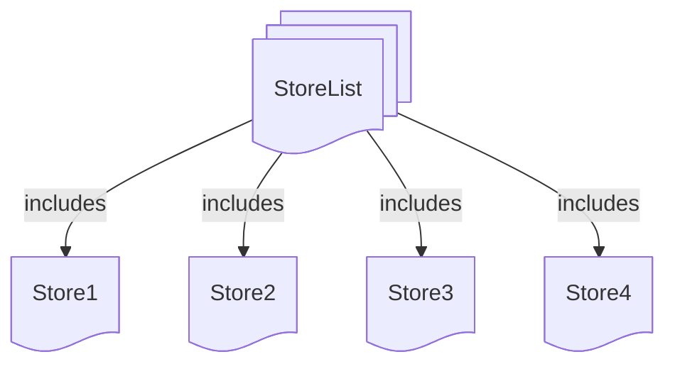

# 1. Sneakers

This is a  README for the educational problem project "Sneakers".
I am still learning and focus on develop the following skills:
- problem solving
- logical reasoning
- algorithmic thinking
- mathematical thinking
- computer science and software engineering

If you are interested please join my reasoning logic and feel free to criticize it.

## 2. Problem

Tom wants to buy a pair of new sneakers. He went to a nearby store and tried a few pairs of different brands. He picked a specific pair of sneakers that he liked. Considering the offline store price Tom decided to check if he could save some money by ordering them online. 

Tom found a few websites that sell the sneakers he picked. To decide which store to buy from he made the following table:

| Store   | Sneakers price, USD | Delivery fee, USD | Additional Conditions                         |
| ------- | ------------------- | ----------------- | --------------------------------------------- |
| Store 1 | $97.89$             | $3.16$            | Free delivery for cart sums over $105.26$ USD |
| Store 2 | $93.68$             | $5.26$            | None                                          |
| Store 3 | $105.26$            | $2.11$            | Discount of $10.53$ USD on the first order    |
| Store 4 | $100.00$            | Free              | None                                          |


## 3. Categorise the problem

Tom needs to decide which store to buy from. Assuming that the quality of the sneakers is the same, the `decision` problem is to choose the store with the lowest expenses (best `deal price`).

Lets take a brief look at the table.

---

## 4. Elements: extract
`decision`, `store list`, `store`, `deal price`


Tom's table represents a `store list` helping to make a `decision` to pick a `store` based on the best `deal price`.

---

### 4.1. `decision`


The most important element of the problem is the answer itself: a specific store, `decision` to be made.

---

### 4.2. `store list`

Second element is the store list to pick a store from. 

>[!tip] 
`python list` small bite (skippable section).
We can store lists inside computer memory using `python` programming language.
Put comma "`,`" separated items in square "`[ ]`" brackets to create a list: `[item1, item2, item3 ]`.  Use equals `=` to assign a name to a list.
Use `print( )` to display a list. `#` comment a line (execution ignore).

```python
# create sneakers price list and assign it to a variable `sneakers_price_list`
sneakers_price_list = [97.89, 93.68, 105.26, 100.00]
# print on display sneakers_price_list
print(sneakers_price_list)
```
result:
```
[97.89, 93.68, 105.26, 100.00]
```

>[!tip]
>TRY and PLAY online [Click the red RUN button (top right) and feel free to change the code and play around](https://onecompiler.com/python/43gze9xnr)

---

### 4.3. `store`
Store list consists of individual stores. It is the first Tom's table column.

---

### 4.4. `deal price`
The `decision` is based on the information about the `store` `deal price`. There is no such information as `deal price` in the Tom's table but we understand that the other 3 columns provide us with essential information related to the `deal price`:
- sneakers price
- delivery fee
- additional conditions

We can make `deal price` element more detailed by adding sub-elements to it but the main point here that no relevant information is lost. To keep it simple we avoid adding more known sub elements at this stage. Moreover the system  can increase in complexity. That means that Tom later can find some other factors impacting the deal price: (transaction fees, delivery insurance etc.). Having such abstraction as `deal price` can help us to handle this new information.

To sum up, we can say that we united 3 columns into one abstraction: **`deal price`**.  
The Tom's table could look something like this:

<a name="deal-price-abstraction-table"></a>
<table>
  <thead>
    <tr>
      <th rowspan="2">Store</th>
      <th colspan="3">Deal price, USD</th>
    </tr>
    <tr>
      <th>Sneakers price, USD</th>
      <th>Delivery fee, USD</th>
      <th>Additional Conditions</th>
    </tr>
  </thead>
  <tbody>
    <tr>
      <td>Store 1</td>
      <td>$97.89</td>
      <td>$3.16</td>
      <td>Free delivery for cart sums over $105.26 USD</td>
    </tr>
    <tr>
      <td>Store 2</td>
      <td>$93.68</td>
      <td>$5.26</td>
      <td>None</td>
    </tr>
    <tr>
      <td>Store 3</td>
      <td>$105.26</td>
      <td>$2.11</td>
      <td>Discount of $10.53 USD on the first order</td>
    </tr>
    <tr>
      <td>Store 4</td>
      <td>$100.00</td>
      <td>Free</td>
      <td>None</td>
    </tr>
  </tbody>
</table>

> [!important] 
> The `deal price` abstraction simplifies problem solving and can potentially make the algorithm more flexible. Later we can add other `deal price` sub-elements if needed (like transaction fees, delivery insurance etc.).

--- 

## 5. Elements: relations
For now we got 4 elements:
 - `decision`
 - `store list`
 - `store`
 - `deal price`
  
Now lets take a closer look at elements combinatorics based on the common sense.

---

### 5.1. `decision` <-> `store list`
`decision` is a result of searching the lowest `deal price`  in the `store list`. 
Hence "searching the lowest `deal price`  in the `store list`" is the relation type between these 2 elements. We recognise a specific algorithm for this relation type: searching minimum value in a list.

Input (algorithms gets a data to work on): `store list`
Algorithm (apply to input): find minimum
Output (algorithm returns a value): `decision`

>[!note]
>Finding list minimum data flow diagram:
>```mermaid
>%%{ init : { "themeVariables": { "htmlLabels": true }}}%%
>graph LR
>	in@{label: "INPUT: \n <code>list=[item1, item2, item3]</code>"}
>	fn@{shape: diamond, label: "ALGO\n Find minimum value\n algorithm:\n <code>min(list)</code>"}
>	out@{label: "OUTPUT: \n <code>item</code> "}
>	in --> fn --> out
>```

We can reverse the data flow (output -> input) and start with asking questions (not putting existing data into algorithms).
- `decision` is asking: Which is the best deal store? Problem text does not contain such information. We decided to applying the `min( )` algorithm to find it out.
- `min( )`  algorithm: Where is my input? Which data should I work on?
- `store list` here is the input data.

```mermaid
%%{ init : { "themeVariables": { "htmlLabels": true }}}%%
graph TB
  decision@{shape: rect, label: "<code>decision</code>"}
  decision -->|which one is the best deal store?| minf
  minf@{shape: diamond, label: "find minimum value function:\n<code>min(list)</code>"}
  minf -->|which list to apply to?| StoreList@{shape: docs, label: "<code>store list</code>"}
  ```
---

This diagrams depict that the questions and the data flows are moving into opposite directions. The question approach can help to chunk the problem from bigger to smaller parts instead of applying combinatorics to known data.

>[!tip] 
`python list` small bite (skippable section)
Fortunately `python` has a built-in function `min()`. It can take a list of numbers and return a minimal  value. Put a list name inside round "`( )`" brackets of `min()`: `min(list_name)`.

Lits change our [small python program](#42-store-list)


```python
# 1. INPUT data
# create sneakers price list and assign it to a variable `sneakers_price_list`
sneakers_price_list = [97.89, 93.68, 105.26, 100.00]
# print on display sneakers_price_list
print(f"The sneakers price list: {sneakers_price_list}")

# 2. ALGORITHM application
# apply min() to `sneakers_price_list` and assign the result to a variable `minimal_sneakers_price`
minimal_sneakers_price = min(sneakers_price_list)

# 3. OUTPUT data (applied algorithm result)
# print  minimal_sneakers_price
print(f"Minimal price is: {minimal_sneakers_price}")
```
result:
```
The sneakers price list: [97.89, 93.68, 105.26, 100.0]
Minimal price is: 93.68
```

>[!tip]
>TRY and PLAY online
[Click the red RUN button (top right) and feel free to change the code and play around](https://onecompiler.com/python/43gzn7zvr)


>[!CAUTION]
> `min(sneakers_price_list)` is NOT a minimal `store` `deal price`! We excluded other important pricing factors such as delivery fee and store-specific conditions. See the difference in the  [table above](#deal-price-abstraction-table).

---

### 5.2 `store list` <-> `store`

`store list` includes one or more stores. `store` is an element of the `store list`. 



---
### 5.3 `store` <-> `deal price`
`deal price` is a property of the `store`


## 6. Elements: diagram

Considering the problem elements and their relationships we can draw the following diagram:


We follow top to bottom approach, question driven approach to avoid getting lost into pricing details and other distractions.

## 7. `deal price`
Now we can discuss the `deal price` in detail. As we metioned before `deal price` is a property of the `store`. The `deal price` data is in 3 columns of the table: Sneakers price, Delivery fee and Additional Conditions. 
We can notice that additional conditions are not applied to each store.

### 7.1 `deal price` no additional conditions
Too keep it simple we start with the stores that have no additional conditions.

> $deal\ price = sneakers\ price + delivery\ fee$

```mermaid
%%{ init : { "themeVariables": { "htmlLabels": true }}}%%
graph TB
  Sum{$$+$$}
  Sum --> sneakers_price@{shape: rect, label: "sneakers price"} & delivery_fee@{shape: rect, label: "delivery fee"}
  Deal_price@{shape: card, label: "Deal price"}
  Deal_price -->Sum  
  ```
  
  ---

The whole path looks like this:
  ```mermaid
%%{ init : { "themeVariables": { "htmlLabels": true }}}%%
graph TB
  decision@{shape: rect, label: "<code>decision</code>"}
  decision -->|get best deal store| minf
  minf@{shape: diamond, label: "find minimum value function:\n<code>min(list)</code>"}
  minf -->|apply to| StoreList@{shape: docs, label: "<code>store list</code>"}
  StoreList --> |includes|Store@{shape: doc}

  Store@{shape: doc} --> |has|deal_price2@{shape: card, label: "<code>deal price</code>"}

  Sum2@{shape: diamond, label: "$$+$$"}
  Sum2 --> sneakers_price1@{shape: rect, label: "sneakers price"} & delivery_fee1@{shape: rect, label: "delivery fee"}

deal_price2-->|NO conditions|Sum2

```
---

Stores 2 and 4 has no extra no conditions.

General model looks like this:


> [!tip]
> We can see the Store 2 and Store 4 apply the same algorithm to calculate the `deal price`. The only difference is the input data.

### 7.2 `deal price` with additional conditions
Now thing are getting more complicated. We need to consider the additional conditions. 
Lets take a closer look at wordings in column `Additional Conditions` of the table. Repeat out approach and extract elements.

#### 7.2.1 `deal price` with additional conditions Store 1
> Store 1:  
> Free delivery for cart sums over $105.26$ USD.

Elements are: `cart sum`, `threshold`

`cart sum` is a variable which depends on products in the cart, their price and quantity. In this case the cart sum is equal to the `sneakers price`. 
The `threshold` is a constant value: $105.26$.

The main formula atays the same:
> $deal\ price = sneakers\ price + delivery\ fee$

But in case Store1 the `delivery fee` is conditional and depends on the `cart sum`:
> $delivery\ fee = 0$ if $cart\ sum > threshold$ else $delivery\ fee$

- `cart sum` - variable
- `threshold` - constant = $105.26$
- `delivery fee` - constant = $3.16$

```mermaid
%%{ init : { "themeVariables": { "htmlLabels": true }}}%%
graph TB
  Deal_price@{shape: card, label: "Deal price"}
  Sum@{shape: diamond, label: "$$+$$"}
  Deal_price -->Sum  
  Sum --> sneakers_price@{shape: rect, label: "sneakers price"} & delivery_fee@{shape: rect, label: "delivery fee"}
  
  delivery_fee -->|which delivery price?|DeliveryDiscount
  DeliveryDiscount@{shape: diamond, label: "discount engine"}
  
  GT@{shape: diamond, label: "<code> 105.26 > cart sum ? yes(1) / no(0)?</code>"}
  Threshold@{shape: rect, label: "$$105.26$$"}
  DeliveryDiscount -->|YES or NO|GT
  GT-->Threshold 
  GT--> cart_sum
  DeliveryDiscount --> |YES| DeliveryFee@{shape: rect, label: "$$3.16$$"}
  DeliveryDiscount --> |NO| DeliveryNull@{shape: rect, label: "$$0$$"}
  %%links
  ```

---

General diagram

```mermaid
%%{ init : { "themeVariables": { "htmlLabels": true }}}%%
graph TB
  decision@{shape: rect, label: "<code>decision</code>"}
  decision -->|get best deal store| minf
  minf@{shape: diamond, label: "find minimum value function:\n<code>min(list)</code>"}
  minf -->|apply to| StoreList@{shape: docs, label: "<code>store list</code>"}
  StoreList --> |includes|Store1@{shape: doc}
  StoreList --> |includes|Store2@{shape: doc}
  StoreList --> |includes|Store3@{shape: doc}
  StoreList --> |includes|Store4@{shape: doc}

  Store1@{shape: doc} --> |has|deal_price1@{shape: card, label: "<code>deal price</code>"}
  Store2@{shape: doc} --> |has|deal_price2@{shape: card, label: "<code>deal price</code>"}
  Store3@{shape: doc} --> |has|deal_price3@{shape: card, label: "<code>deal price</code>"}
  Store4@{shape: doc} --> |has|deal_price4@{shape: card, label: "<code>deal price</code>"}

  Sum2@{shape: diamond, label: "$$+$$"}
  Sum2 --> sneakers_price1@{shape: rect, label: "sneakers price"} & delivery_fee1@{shape: rect, label: "delivery fee"}

  Sum4@{shape: diamond, label: "$$+$$"}
  Sum4 --> sneakers_price4@{shape: rect, label: "sneakers price"} & delivery_fee4@{shape: rect, label: "delivery fee"}
  
  
%% Sum1
  Sum1@{shape: diamond, label: "$$+$$"}
  Sum1 --> sneakers_price@{shape: rect, label: "sneakers price"} & delivery_fee@{shape: rect, label: "delivery fee"}
  
  delivery_fee -->|which delivery price?|DeliveryDiscount
  DeliveryDiscount@{shape: diamond, label: "discount engine"}
  GT@{shape: diamond, label: "<code> 105.26 > cart sum ? yes(1) / no(0)?</code>"}
  Threshold@{shape: rect, label: "$$105.26$$"}
  DeliveryDiscount -->|YES or NO|GT
  GT-->Threshold 
  GT--> cart_sum
  DeliveryDiscount --> |YES| DeliveryFee@{shape: rect, label: "$$3.16$$"}
  DeliveryDiscount --> |NO| DeliveryNull@{shape: rect, label: "$$0$$"}

  deal_price1-->|delivery conditions|Sum1
  deal_price2-->|NO conditions|Sum2
  deal_price4-->|NO conditions|Sum4
```


#### 7.2.2 `deal price` with additional conditions Store 2
> Store 3:   
> Discount of $10.53$ USD on the first order.

Elements are: `discount`, `first order`